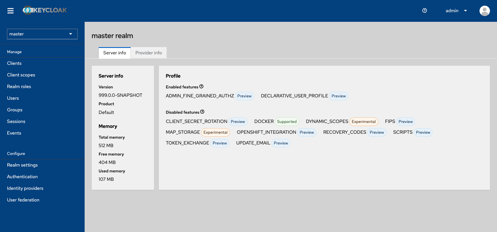

# Customizing Keycloak Themes

The Keycloak Admin UI, which is the interface for managing Keycloak, is built with [PatternFly](https://www.patternfly.org/v4/) - a set of UI design patterns and resources that can be used to create consistent, user-friendly interfaces for web applications.

## Creating Themes

With themes, it is possible to configure the Admin UI's look and feel. To ensure consistency and maintainability of the custom Keycloak theme, we advise using PatternFly best practices when customizing the Keycloak Admin UI. This includes following the recommended folder structure and using PatternFly CSS classes and guidelines when creating custom styles and overrides.

### Required Folder Structure

The recommended folder structure for a custom Keycloak theme is as follows:

├── mytheme/
│ ├── admin/
│ │ ├── resources/
│ │ | ├── assets/
│ │ | ├── css/
│ │ | | ├── styles.css
│ │ | ├── resources/
│ │ ├── theme.properties

In order to add a custom theme, in the `js/apps/keycloak-server/server/themes` folder, create a new folder named `mytheme` (can be any name you desire) which houses your personalized Admin UI theme. Within the `admin` sub-folder of this `mytheme` folder, there is a `theme.properties` file, along with a `resources` sub-folder that encompasses directories for CSS files, JavaScript files, and images. Within the `css` sub-folder, there is a `styles.css` file, which allows the addition of customized PatternFly styles. The `theme.properties` is a configuration file defines attributes such as the parent theme, and theme css. The `theme.properties` file is used to register the theme with the Keycloak server and integrate it with the Keycloak user interface.

### Customizing with PatternFly Best Practices

Overrides to PatternFly variables should be made at the `:root` level for global variables or at the top-level component selector for component variables (for example, `.pf-c-\*`), as these overrides will cascade down to children elements accordingly.

To customize your Keycloak theme with PatternFly best practices, we recommend the following:

1. To get started, you can utilize either our `extend-admin-ui-quick-start/src/mytheme` template or choose a theme from the theme directory located at `../lib/lib/main/org.keycloak.keycloak-themes-999.0.0-SNAPSHOT.jar`, which can be accessed using any standard ZIP archive tool.
2. Use the provided PatternFly CSS classes when possible, rather than creating custom classes.
3. Follow the recommended folder structure and naming conventions for your custom theme.
4. Override the PatterFly variables at the `:root` level or at the top level component using the `pf-c-\*` naming convention (both examples are provided in the `styles.css` and [Patternfly documentation](https://www.patternfly.org/v4/developer-resources/global-css-variables/)).
5. Create a custom stylesheet `(styles.css)` in the `resources/css` folder to contain your custom styles and overrides.
6. Define your custom `styles=css/styles.css` in the `theme.properties` file. Make sure to add `parent=keycloak.v2` as parent theme for this custom theme. `title` of the Admin ui can be changed as well as `logo`.

By following these best practices, you can ensure that your custom Keycloak theme remains consistent with the Keycloak Admin UI and is easy to maintain and update.

### Applying a Customized Theme

Start the Keycloak server by running the command `npm run start --workspace=keycloak-server`. To launch the Admin UI run the command `npm run dev`. After that, log in by accessing `http://localhost:8080/` and navigate to the `Themes` tab located in `Realm settings`. From there, change the Admin UI theme to your preferred custom theme. Finally, navigate to `http://localhost:8180/` to view the style you created being applied.

This is what you will see when you log in.

When you access the Clients section, this is the view that will be presented to you.

**Built-in themes should not be modified directly, instead a custom theme should be created.**

## Disclaimer

The way PatternFly variables are used in the Admin UI is subject to change, as we may update and modify the design system to better suit the needs of our users. Additionally, PatternFly, the design system on which our UI is based, may also make changes to their variables in future updates. As such, any information, analysis, or conclusions drawn from the current use of PatternFly variables in the Admin UI may not necessarily hold true or remain valid in the future. It is important to consider the potential for changes in the way we use PatternFly variables and any updates to the PatternFly design system, and to update any relevant information accordingly.
